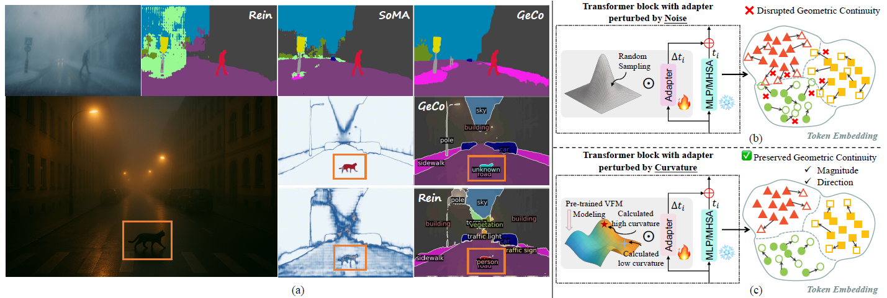

# GeCo

**Geometry-Consistent Regularization for Domain Generalized Semantic Segmentation**

GeCo is a geometry-consistent regularization framework for domain generalized semantic segmentation. The idea is simple in spirit: when a model leaves the comfort of its source domain, its predictions should still respect the local geometry of the representation space. GeCo perturbs features along geometry-aware directions and regularizes the segmentation output to stay consistent under those perturbations.

Our paper was accepted by **CVPR 2026**:

[GeCo: Geometry-Consistent Regularization for Domain Generalized Semantic Segmentation](https://openaccess.thecvf.com/content/CVPR2026/papers/Zang_GeCo_Geometry-Consistent_Regularization_for_Domain_Generalized_Semantic_Segmentation_CVPR_2026_paper.pdf)

## Pipeline



GeCo encourages segmentation predictions to remain stable under geometry-aware feature perturbations. The pipeline above illustrates how geometry-consistent regularization is injected into the training process while preserving the standard source-domain supervised objective.

## Model Zoo

We provide a trained GeCo checkpoint for the default GTA5 512x512 setting:

```text
best_mean_mIoU_iter_16000.pth
```

This checkpoint is trained on GTA5 at 512x512 resolution and selected by best validation mean mIoU over Cityscapes, BDD100K, and Mapillary:

```text
Cityscapes: 71.87
BDD100K:    60.10
Mapillary:  71.71
Average:    67.89
```

The checkpoint is hosted on Google Drive:

[Download GeCo GTA5 512 checkpoint](https://drive.google.com/open?id=1sw-KOr5xIhFev0V3mO4MQvJivtXyfSCn)

Drive path:

```text
GeCo/weights/best_mean_mIoU_iter_16000.pth
```

SHA256:

```text
afe9a0c16b4387211ae7591ef9712b246a557530842f2f45ea9a7ff80185f997
```

## Repository Layout

```text
configs/
  _base_/                 # dataset, runtime, and model base configs
  geco/                   # GeCo training and evaluation configs
rein/
  models/utils/           # GeCo regularizer
  models/segmentors/      # GeCo segmentation wrapper
tools/
  train.py
  test.py
  convert_models/
sbatch/
  train_eval_geco_dinov2_gta_1gpu.sbatch
  eval_geco_dinov2_gta_domains_1gpu.sbatch
```

## Installation

Create an environment compatible with PyTorch, MMCV, MMEngine, MMSegmentation, and MMDetection. The exact versions we used on our cluster were:

```bash
conda create -n geco python=3.10 -y
conda activate geco

pip install torch==2.0.1+cu117 torchvision==0.15.2+cu117 torchaudio==2.0.2+cu117 \
  --index-url https://download.pytorch.org/whl/cu117

pip install mmengine==0.10.7 mmcv==2.0.0 mmsegmentation==1.2.2 mmdet==3.3.0
pip install -r requirements.txt
```

You also need the DINOv2-L pretrained checkpoint:

```text
checkpoints/dinov2_vitl14_pretrain.pth
```

The Slurm script will convert it on first use:

```text
checkpoints/dinov2_geco_converted.pth
```

## Dataset Format

Place datasets under `data/`. For the default GTAV -> Cityscapes / BDD / Mapillary experiment, the expected layout is:

```text
data/
  gta/
    images/
    labels/
  cityscapes/
    leftImg8bit/
    gtFine/
  bdd100k/
    images/
      10k/
        val/
    labels/
      sem_seg/
        masks/
          val/
  mapillary/
    validation/
      images/
      labels/
```

The exact paths used by the dataloaders are defined in:

```text
configs/_base_/datasets/gta_512x512.py
configs/_base_/datasets/cityscapes_512x512.py
configs/_base_/datasets/bdd100k_512x512.py
configs/_base_/datasets/mapillary_512x512.py
configs/_base_/datasets/dg_gta_512x512.py
```

If your local dataset tree differs, update those config files rather than changing the training code.

## Train GeCo

Default GeCo training config:

```text
configs/geco/geco_dinov2-L_mask2former_gta.py
```

Run training and three-domain evaluation with:

```bash
sbatch sbatch/train_eval_geco_dinov2_gta_1gpu.sbatch
```

For a non-Slurm run:

```bash
python tools/train.py configs/geco/geco_dinov2-L_mask2former_gta.py \
  --work-dir work_dirs/geco_dinov2_gta
```

## Evaluate GeCo

Evaluate a trained checkpoint on Cityscapes, BDD, and Mapillary:

```bash
CHECKPOINT=work_dirs/geco_dinov2_gta/iter_40000.pth \
sbatch sbatch/eval_geco_dinov2_gta_domains_1gpu.sbatch
```

Or run one domain manually:

```bash
python tools/test.py \
  configs/geco/eval_geco_gta_to_cityscapes_512x512.py \
  work_dirs/geco_dinov2_gta/iter_40000.pth \
  --backbone checkpoints/dinov2_geco_converted.pth \
  --work-dir work_dirs/eval_geco_dinov2_gta/cityscapes
```

## Main Config Knobs

The default GeCo regularizer is configured in `configs/geco/geco_dinov2-L_mask2former_gta.py`:

```python
geco_regularizer=dict(
    alpha=0.1,
    beta=0.2,
    lambda_geo=0.1,
    num_neighbors=8,
    tangent_dim=4,
    perturb_levels=(-1,),
    warmup_iters=1000,
)
```

This is the setting we recommend starting from.

## Citation

If GeCo helps your research, please cite:

```bibtex
@InProceedings{Zang_2026_CVPR,
    author    = {Zang, Qi and Zhao, Dong and Pu, Nan and Li, Wenjing and Zhong, Zhun and Wang, Meng},
    title     = {GeCo: Geometry-Consistent Regularization for Domain Generalized Semantic Segmentation},
    booktitle = {Proceedings of the IEEE/CVF Conference on Computer Vision and Pattern Recognition (CVPR)},
    month     = {June},
    year      = {2026},
    pages     = {871-881}
}
```
